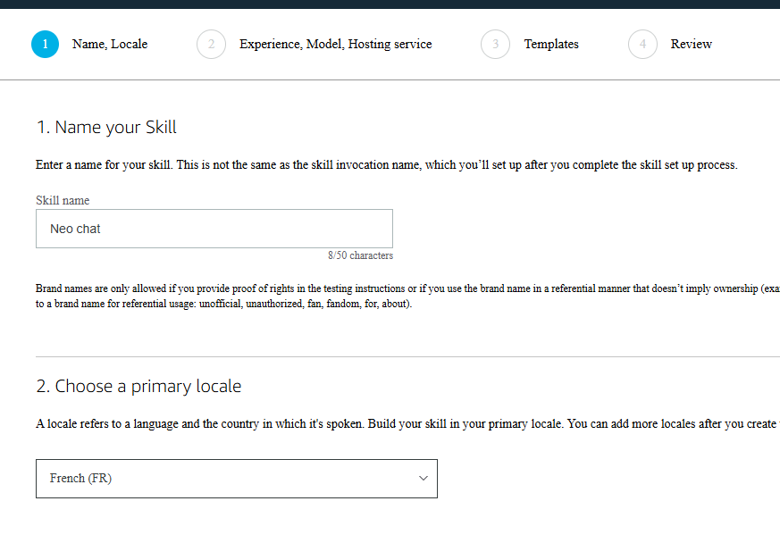
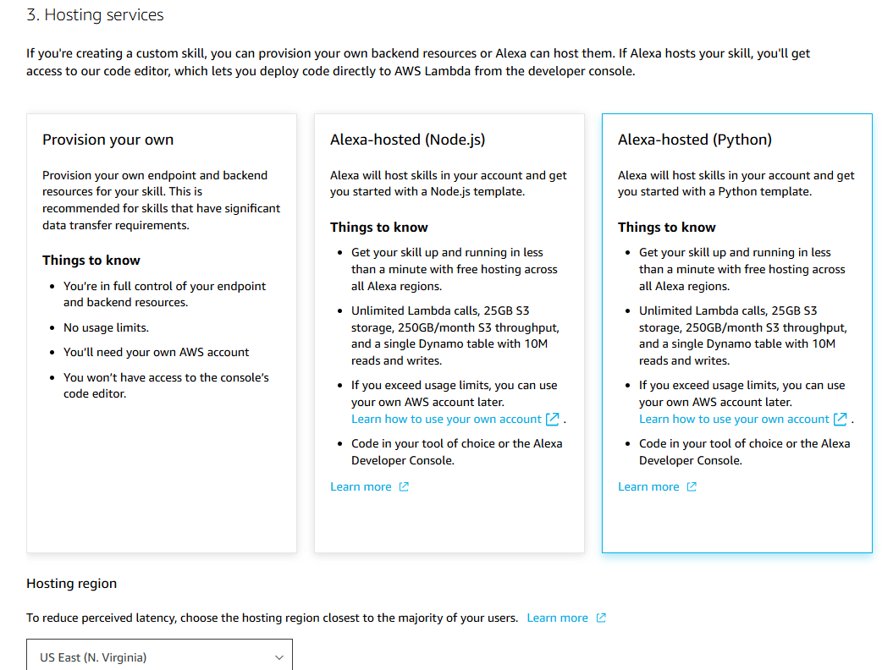
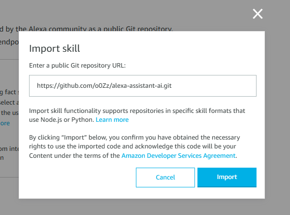

# Alexa AI Assistant

Alexa custom skill that routes user questions to a selectable LLM provider (GitHub Copilot, ChatGPT, Claude, or MistralAI) and returns an answer.

<div align="center">
    
</div>

## Features

- Support multiple providers:
    - **GitHub Copilot**
    - **ChatGPT**
    - **Claude**
    - **MistralAI**
- Support multiple languages
- Optional follow-up suggestions
- Conversation context memory in session

## Supported languages

Language currently available (In `lambda/langs/`):

- English
- German
- Spanish
- French
- Hindi
- Italian
- Japanese
- Portuguese

## Prerequisites

- Amazon Developer account: https://developer.amazon.com/
- One LLM provider account and API key/token:
    - GitHub token (with `models:read` permission)
    - OpenAI API key
    - Anthropic API key
    - Mistral API key

## Step-by-step tutorial

### 1.
 Login to https://developer.amazon.com/alexa/console/ask

### 2. 
Click on "Create Skill" and name the skill "AI Assistant". Choose the primary locale according to your language.


### 3. 
Choose "Other" and "Custom" for the model.


### 4. 
Choose "Alexa-hosted (Python)" for the backend resources.



### 5. 
Click on "Import Skill", paste the link of this repository (https://github.com/o0zz/alexa-assistant-ai.git) and click on "Import".


### 6. 
In the "Build" section, navigate to the "JSON Editor" tab.

### 7. 
Just change the "invocationName" to "ai assistant" or another preferred word for activation.

### 8. 
In the "Code" section, navigate to the `lambda/config.py` file

- Choose one `AGENT = ...`
- Set its API token/key
- Set `ENABLE_FOLLOWUP_SUGGESTIONS` to `True` or `False`

Current examples in file:

```python
AGENT = GitHubCopilotAgent(model="gpt-4.1", api_token="...")
#AGENT = ChatGPTAgent(model="gpt-4o-mini", api_token="...")
#AGENT = ClaudeAgent(model="claude-3-5-sonnet-20241022", api_token="...")
#AGENT = MistralAI(model="mistral-small-latest", api_token="...")

ENABLE_FOLLOWUP_SUGGESTIONS = False
```

### 9. 
Save and deploy. Go to "Test" section and enable "Skill testing" in "Development".


### 10. 
You are now ready to use your Alexa in AI Assistant mode. You should see results like this:


## Cost notice

Using this skill can generate costs (AWS Lambda + model provider usage). Monitor your billing and quotas.

## Inspiration

Inspired by: https://github.com/k4l1sh/alexa-gpt